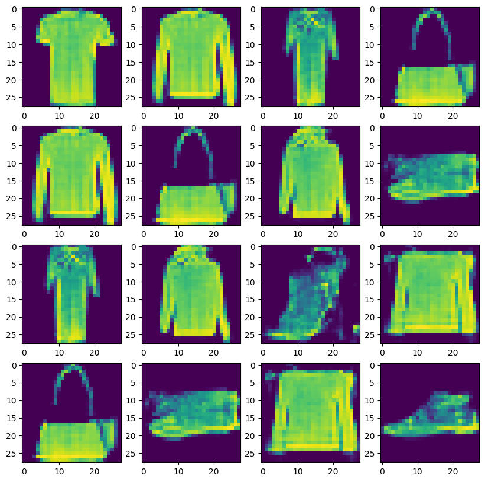

# FashionGAN
A Generative Adversarial Network (GAN) built with TensorFlow. It generates fashion item images based on the Fashion MNIST dataset.

## Overview
This project implements a GAN from scratch using TensorFlow/Keras. The model learns to generate realistic fashion images (28×28 pixels) by training a generator and discriminator in an adversarial setup.

## 

## Architecture

### Generator

- Input: 128-dimensional random noise vector
- 2 upsampling blocks
- 2 additional Conv2D blocks
- Activation function: LeakyReLU
- Output: 28×28×1 image with sigmoid activation

### Discriminator

Four Conv2D + LeakyReLU + Dropout blocks
Flatten → Dense(1) with sigmoid activation
Classifies images as real or fake

## Training Details
| Parameter | Value |
| :--- | :--- |
| Dataset | Fashion MNIST (60,000 images) |
| Batch size | 128 |
| Epochs | 2000 |
| Generator learning rate | 0.0001 |
| Discriminator learning rate | 0.00001 |
| Optimizer | Adam |
| Loss function | Binary Cross-Entropy |

## Usage
Run the notebook in Google Colab. Generated images are saved per epoch to Google Drive under `ColabNotebooks/GANv2/images/`.